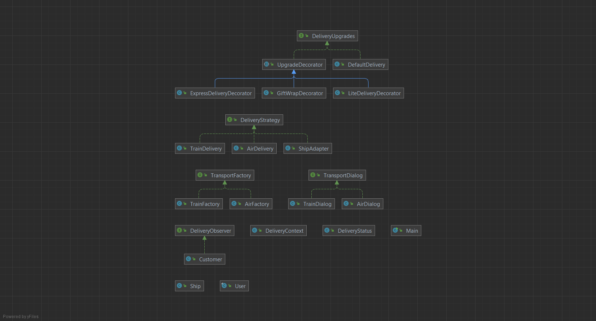

# Delivery Service

This Java project showcases the implementation of various design patterns to create a flexible and extensible delivery service. The primary design patterns utilized include Singleton, Strategy, Factory, Decorator, Observer, and Adapter.

## Project Focus

The project focuses on creating a flexible and maintainable delivery service by leveraging various design patterns. From managing user instances to executing dynamic delivery strategies, each pattern addresses specific concerns, contributing to the overall modularity and scalability of the code.

## Purpose of the Work
* __Design Patterns Exploration:__ The project serves as an educational resource for understanding and implementing essential design patterns in Java.
* __Delivery System Simulation:__ The code mimics a simplified delivery service, showcasing how design patterns contribute to the modularity, scalability, and maintainability of the codebase.

## UML Diagram



## Objectives

* [Singleton](#Singleton)
* [Strategy](#Strategy)
* [Factory](#Factory)
* [Decorator](#Decorator)
* [Observer](#Observer)
* [Adapter](#Adapter)
* [Main Class](#Main)

## Singleton

The `User` class is implemented as a Singleton, ensuring that there is only one instance of the user throughout the application's lifecycle.

```java
User user = User.getInstance("assan");
```

## Strategy

The delivery strategies are implemented using the Strategy pattern. The `DeliveryContext` class allows you to set different delivery strategies, such as `TrainDelivery` and `AirDelivery`, which can be executed dynamically.

```java
DeliveryContext strategy = new DeliveryContext();
strategy.setDeliveryStrategy(new TrainDelivery());
strategy.executeDelivery();
```

## Factory

The Factory pattern is employed to create different types of transport vehicles. `TrainFactory` and `AirFactory` implement the `TransportFactory` interface, providing a way to order vehicles for delivery.

```java
TransportDialog trainDialog = new TrainDialog();
TransportFactory train = trainDialog.createVehicle();
train.orderVehicle();
```

## Decorator

The Decorator pattern is used for enhancing the delivery process. `UpgradeDecorator` is an abstract class that serves as the base for concrete decorators like `ExpressDeliveryDecorator`, `GiftWrapDecorator`, and `LiteDeliveryDecorator`.

```java
DeliveryUpgrades basicDelivery = new DefaultDelivery();
DeliveryUpgrades giftWrapDelivery = new GiftWrapDecorator(basicDelivery);
DeliveryUpgrades expressGiftWrapDelivery = new ExpressDeliveryDecorator(giftWrapDelivery);
expressGiftWrapDelivery.deliver("Wolf St.");
```

## Observer

The Observer pattern is implemented for tracking the delivery status. `DeliveryStatus` maintains a list of observers (in this case, customers) and notifies them when the status changes.

```java
DeliveryStatus deliveryStatus = new DeliveryStatus();
Customer customer = new Customer(User.name);
deliveryStatus.addObserver(customer);
deliveryStatus.setStatus("Package is being shipped");
```

## Adapter

The Adapter pattern is utilized with the `ShipAdapter` class, allowing the Ship class to be used as a `DeliveryStrategy`. This demonstrates how different delivery systems can be adapted to the common `DeliveryStrategy` interface.

```java
Ship ship = new Ship();
DeliveryStrategy shipAdapter = new ShipAdapter(ship);
shipAdapter.delivery();
```

## Main

The `Main` class serves as the entry point to the application. It demonstrates the use of the implemented design patterns by creating instances of the classes and showcasing their interactions.

```java
public class Main {
    public static void main(String[] args) {

        //Singleton
        User user = User.getInstance("assan");
        System.out.println("Welcome, " + User.name.toUpperCase() + ".");

        //Strategy
        DeliveryContext strategy = new DeliveryContext();
        strategy.setDeliveryStrategy(new TrainDelivery());
        strategy.executeDelivery();

        //Factory
        TransportDialog trainDialog = new TrainDialog();
        TransportFactory train = trainDialog.createVehicle();
        train.orderVehicle();

        //Decorator
        DeliveryUpgrades basicDelivery = new DefaultDelivery();
        DeliveryUpgrades giftWrapDelivery = new GiftWrapDecorator(basicDelivery);
        DeliveryUpgrades expressGiftWrapDelivery = new ExpressDeliveryDecorator(giftWrapDelivery);
        expressGiftWrapDelivery.deliver("Wolf St.");

        //Observer
        DeliveryStatus deliveryStatus = new DeliveryStatus();
        Customer customer = new Customer(User.name);
        deliveryStatus.addObserver(customer);
        deliveryStatus.setStatus("Package is being shipped");

        //Adapter
        Ship ship = new Ship();
        DeliveryStrategy shipAdapter = new ShipAdapter(ship);
        shipAdapter.delivery();

    }
}
```
